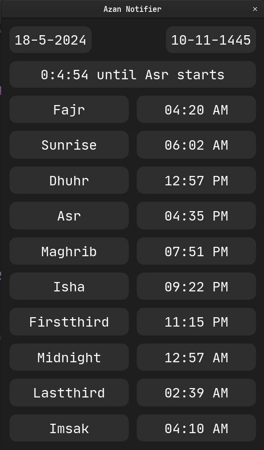

# AzanNotifier

AzanNotifier is a Python-based tool designed to help users stay informed about prayer times. This tool provides timely notifications for the five daily prayers, helping users maintain their prayer schedule conveniently.

## Features

- **Prayer Time Notifications**: Get notified of the five daily prayer times.
- **Customizable Settings**: Adjust notification settings to suit your preferences.
- **Support for Multiple Locations**: Set your location to receive accurate prayer times.
- **User-Friendly Interface**: Easy to set up and use, even for those with minimal technical knowledge.

## Screenshots

Here are some screenshots of AzanNotifier in action:

1. *Main Interface*:


## Requirements

- Python 3.6+
- `requests` library
- `PyQt5` library
- `plyer` library

## Installation

1. Clone the repository:
    ```bash
    git clone https://github.com/MarwanMagdy0/AzanNotifier.git
    cd AzanNotifier
    ```

2. Download the current year's data:
    ```bash
    python install_year_data.py
    ```

3. Run the main script:
    ```bash
    python main.py
    ```

## License

This project is licensed under the MIT License. See the [LICENSE](LICENSE) file for details.
